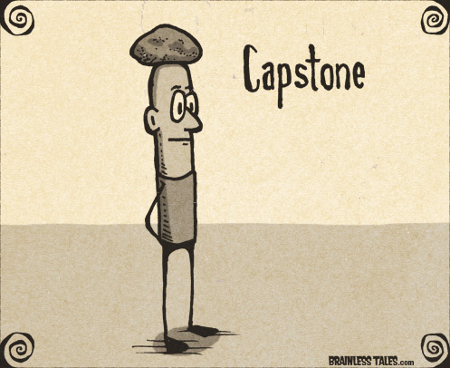

# Galvanize Capstone Project Ryo Iwata

# Background of Project

Some Information

# Relevant Infromation

Some Relevant Information

# Goal/Question

1. To find America's Next Top Model
2. What can I predict? 

# Page Set Up

# Tools Used

Python Programming.

# Web Scraping
Used Python Library of requests and Beautiful Soup

# Database
Pipelined the webscraping data into a Mongos Database.

# Hypotheses
Ho- Null Hypotheses
Ha= Alternative Hypotheses

# EDA
1. Explored the data

# Model Built
1. America's Next Top Model

# Results/What was learned?
1. Small and quick iterations :)

# Things to have done differently
1. Plan accordingly

# Next Step
1. Have a project

# Acknowledgements
Acknowledged

# References
Referenced