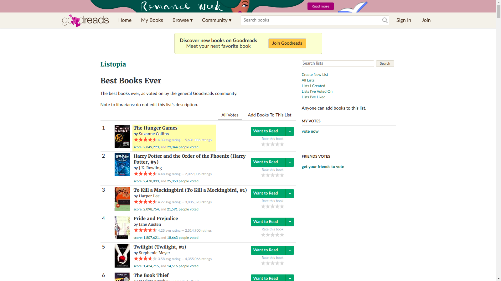
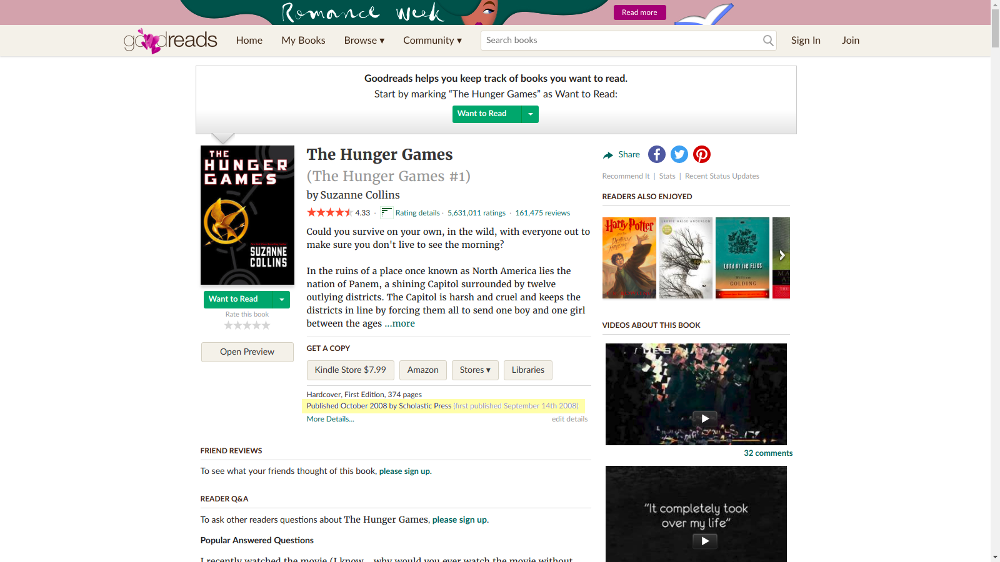
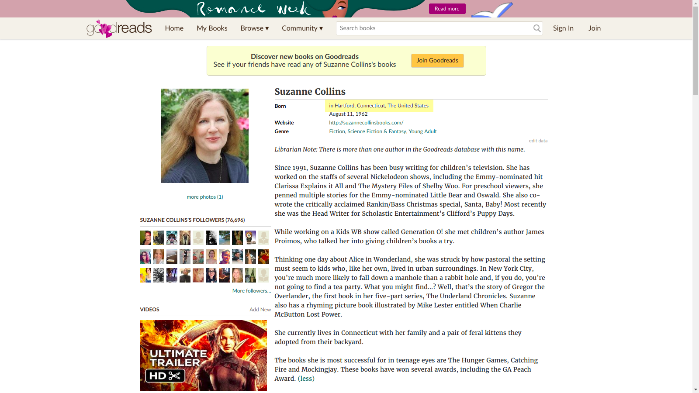

# Galvanize Capstone Project Ryo Iwata

# Goal

To utilize webscraping to better understand the characteristics of books in Goodreads's Best Books Ever list. (https://www.goodreads.com/list/show/1.Best_Books_Ever) This is a user generated list where the community is encouraged to vote on books that are the best to them. There is no limit on how many books a user can vote for. I scraped for the title, author name, author's country of origin, genre, year of book release, number of votes, average ratings, number of ratings of the top 1000 books. There was information of demographics of Good Readers user based on country that was used. This information was provided by Otis Chandler, CEO of GoodReads on a GoodReads forum. (https://www.goodreads.com/topic/show/346243-members-by-country?comment_id=17392983#comment_17431975)

# Questions

1. What are the general characteristics of books in the Good Reads Best Books list?

2. Are American Authors over represented in the Good Reads Best Books list?

# Page Set Up

  

# Tools Used

Python Programming and the Beautiful Soup, Pandas, and Matplotlib Libraries. Websraped data was pipelined into MongosDB.

 

# Web Scraping
Used Python Library of requests and Beautiful Soup
Link: https://www.goodreads.com/shelf/show/currently-reading?page=1

# Database
Pipelined the webscraping data into a Mongos Database.

# EDA

Check Jupyter Notebook file Capstone_1_Ryo_Iwata.ipynb for more details

1. How are the books distributed by genre?
  -Plotted the number of votes by genre in a bar graph.

2. How are the books distributed by country of author?
  -Plotted the number of votes by country of author in a bar graph.
  -Made a pie chart of certain countries to see how books are distributed by certain country

3. How are the books distributed by year of release?
  -Plotted the number of votes by year of release in a bar graph.
  -Made a pie chart of certain years to see how books are distributed by certain year

4. What's the relationship between number of users in a country and the number of votes of a book grouped by country?
  -Plotted the number of votes of book grouped by birthplace of an author against the number of users in a country matched by country name

# What was learned?

1. That working with data that has a group that overwhelms the other groups is difficult
2. I have not learned whether or not American authors are over represented in the GoodReads Best Books list
3. That a handful of books can dominate over the share of votes by country and by year

# Things to have done differently

1. Not to allocate so much time to figuring out how to webscrape.
2. Look into the countries that are not the United States and United Kingdom more closely
3. Have concrete questions to be asked that can be tested
4. Plan, plan, plan to make the best out of limited human time

# Next Step

1. Figure out what statistical test is most appropriate for the given dataset.
